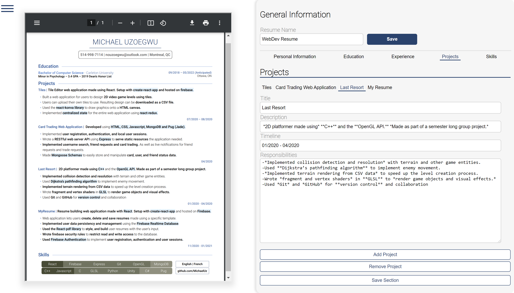
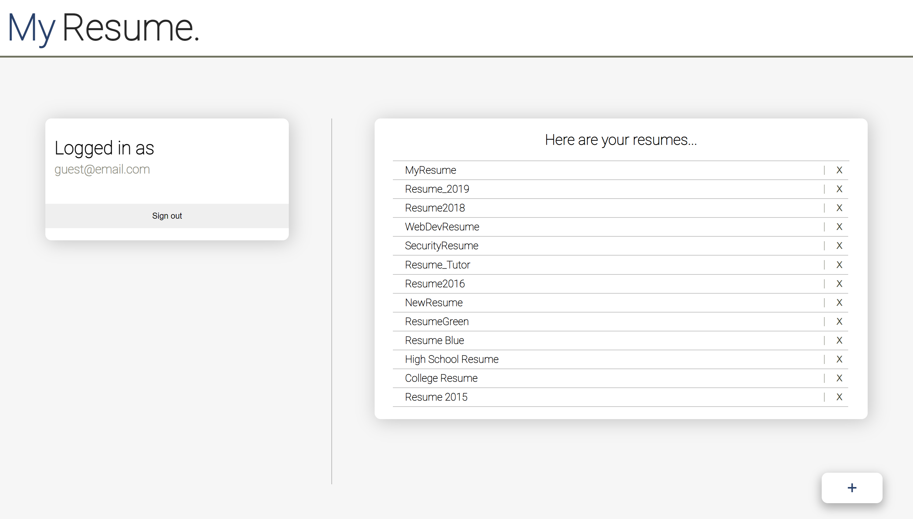

# MyResume
Checkout MyResume [here](https://myresume-2e851.web.app/)

### What is MyResume?

MyResume is a resume managing and editiing web application.

- **Create and store** resumes that use a specific template.
- **Quickly see what your changes look like** with the PDF Viewer. 
- **Download your resume** when you're done. 
- Login as a guest for quick access or create an account to save your resumes.

## Technologies and Libraries

- Bootstrapped with create-react-app.
- Used [react-pdf](https://react-pdf.org/) to create the pdf documents and to display a pdf viewer.
- Used **Firebase** for authentication and data storage.

## Screenshots

